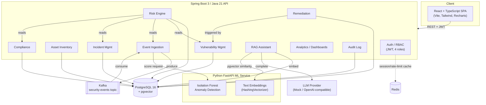

# Architecture

## System overview

The platform is a service-oriented monolith-plus-ML-sidecar: a single Spring Boot API
owns all transactional business logic and RBAC, a Python FastAPI service owns the two
things Python's ML ecosystem does best (anomaly detection, text embeddings), and a React
SPA consumes the API. This keeps operational surface area small (three deployables) while
still cleanly separating "business logic in a strongly-typed language" from "ML logic in
the language with the ML ecosystem" - see [docs/INTERVIEW_GUIDE.md](INTERVIEW_GUIDE.md)
for the reasoning behind not going further into microservices.

## Module boundaries (backend)

Each package under `backend/src/main/java/com/deloitte/erip/` is a vertical slice
(entity + repository + service + controller + DTOs), not a horizontal layer, so a change
to "how vulnerabilities work" touches one folder:

- `security/` - JWT issuance/validation, Spring Security config, refresh tokens
- `user/` - user management, RBAC roles
- `asset/` - asset inventory (criticality, exposure, business unit)
- `vulnerability/` - CVE/CVSS tracking; publishes `VulnerabilityCreatedEvent`
- `event/` - Kafka producer/consumer for security events
- `anomaly/` - thin client to the ML service's anomaly endpoint
- `risk/` - the explainable scoring engine (pure logic + orchestration service)
- `incident/` - incident lifecycle
- `compliance/` - NIST CSF / ISO 27001 / SOC 2 control catalog and assessments
- `remediation/` - listens for new vulnerabilities, auto-generates prioritized guidance
- `rag/` - embeddings, pgvector retrieval, LLM provider abstraction, conversation log
- `analytics/` - read-side aggregation for the two dashboards
- `audit/` - append-only audit trail, written by every mutating service
- `common/` - base entity, DTOs, centralized exception handling

Cross-module coupling is intentionally read-only and one-directional where possible
(e.g. the risk engine *reads* vulnerabilities/events/incidents/compliance but none of
those modules know the risk engine exists), and event-driven where a write-side reaction
is needed (remediation listens for `VulnerabilityCreatedEvent` via a
`@TransactionalEventListener` rather than `VulnerabilityService` calling
`RemediationService` directly).

## Request flow: an analyst asks "why is this asset high risk?"

1. Frontend calls `GET /api/v1/risk-scores/assets/{id}/latest` with a JWT bearer token.
2. `JwtAuthenticationFilter` validates the token and populates the `SecurityContext`.
3. `RiskController` -> `RiskScoreService.getLatest()` reads the most recent `RiskScore`
   row, which already contains a JSON `explanation` blob (weights, inputs, top
   contributing vulnerabilities, and a narrative sentence) computed at score time.
4. The frontend renders the five weighted components as progress bars plus the narrative,
   so the "why" is answerable without a second round-trip or any client-side reasoning.

## Deployment

See [docs/AWS_DEPLOYMENT.md](AWS_DEPLOYMENT.md) for a reference cloud topology and
`docker-compose.yml` for the local all-in-one environment.
