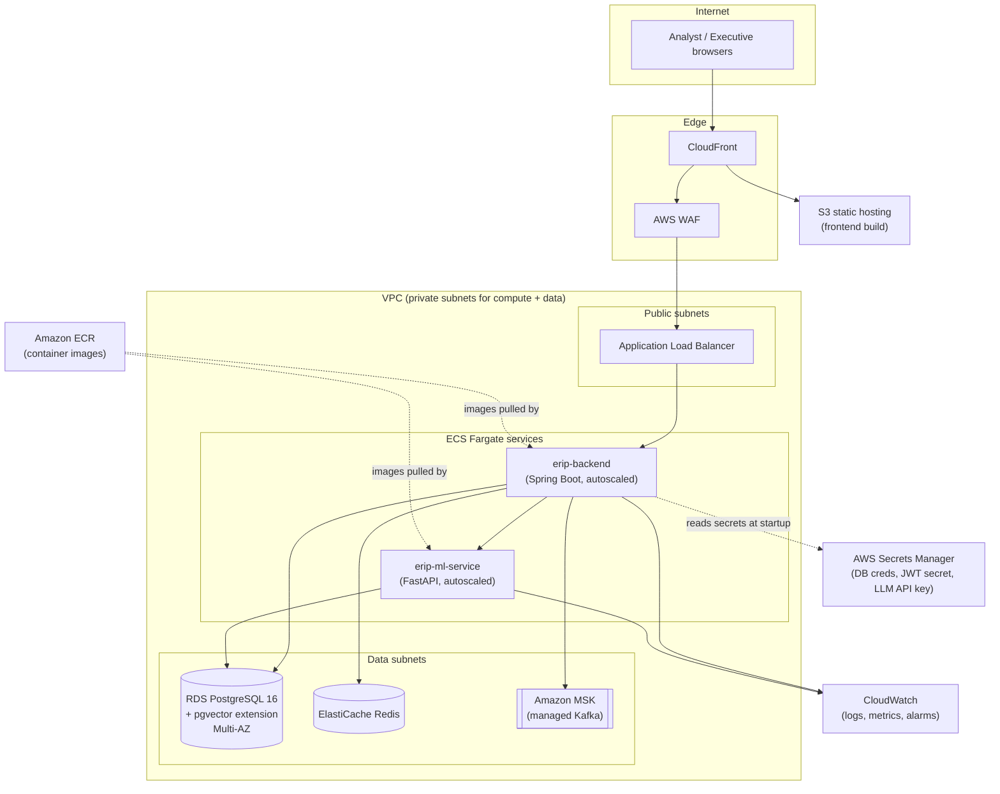

# Reference AWS Deployment Topology

This is a reference architecture for running the platform on AWS in production. The
local `docker-compose.yml` environment is intentionally structured so each service maps
1:1 onto a managed AWS equivalent, minimizing rework going from local to cloud.

## Mapping from local to AWS

| Local (docker-compose) | AWS equivalent | Notes |
|---|---|---|
| `postgres` (pgvector/pgvector image) | RDS for PostgreSQL 16 with the `vector` extension enabled | Multi-AZ for production; `db.r6g` family for pgvector's memory-bound IVFFlat index |
| `redis` | ElastiCache for Redis | Used for JWT-adjacent caching/rate-limiting as the platform grows |
| `kafka` | Amazon MSK (or MSK Serverless) | Same topic names/partitioning; Spring Kafka config only needs new bootstrap servers |
| `backend`, `ml-service` | ECS Fargate services behind the ALB | Stateless containers; horizontal autoscaling on CPU/request count |
| `frontend` (nginx container) | S3 + CloudFront | A built SPA is static assets; no need to run a container for it in production |
| Environment variables in `docker-compose.yml` | AWS Secrets Manager + ECS task definition secrets | `JWT_SECRET`, DB credentials, and `LLM_API_KEY` are injected at task startup, never baked into images |
| N/A | AWS WAF in front of CloudFront/ALB | Rate limiting and common web-attack filtering for the public-facing app |
| N/A | CloudWatch Logs + Container Insights | Centralized logging/metrics for both Fargate services |

## CI/CD to AWS (extending `.github/workflows/ci.yml`)

The existing CI workflow builds and tests all three components and sanity-builds their
Docker images. A production deployment workflow would add, after `docker-build` passes
on `main`:

1. `aws ecr get-login-password` + `docker push` for `erip-backend` and `erip-ml-service`
   images to ECR, tagged with the commit SHA.
2. `aws ecs update-service --force-new-deployment` (or a CDK/Terraform `apply`) to roll
   the new task definition revision out via ECS's built-in rolling deployment.
3. `aws s3 sync frontend/dist s3://<bucket>` + a CloudFront invalidation for the SPA.
4. Flyway migrations run as an ECS one-off task (or via the backend's own startup
   migration, guarded by a deployment order that runs a single migration task before
   scaling up the new backend revision) rather than allowing every replica to race to
   apply migrations concurrently.
