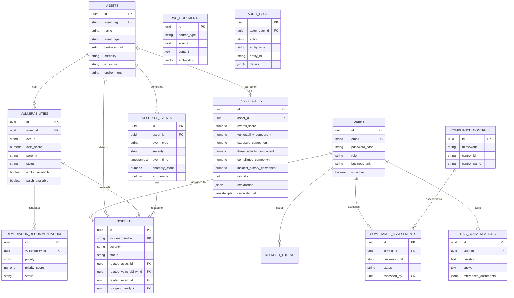

# Database Entity-Relationship Diagram

Schema source of truth: `backend/src/main/resources/db/migration/V1__init_schema.sql`
(Flyway-versioned; V2 seeds the compliance control catalog, V3 seeds demo users).

## Notable design choices

- **UUID primary keys everywhere** - avoids sequential-ID enumeration across tenants/
  environments and lets the synthetic-data generator and the app both mint IDs client-side.
- **`risk_scores` is append-only, not upserted** - every recomputation inserts a new row,
  so `docs/RISK_ENGINE.md`'s trend charts and audit trail come for free from `calculated_at`.
- **`rag_documents.embedding` is `vector(384)`** (pgvector) with an IVFFlat cosine index -
  see [docs/RAG_FLOW.md](RAG_FLOW.md) for why 384 dimensions and why JDBC rather than JPA
  is used for this one table.
- **`audit_logs` has no foreign-key `ON DELETE CASCADE` other than `SET NULL`** on the
  actor - audit history must outlive the user account that generated it.
