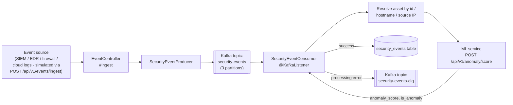

# Kafka Event Ingestion Pipeline

Security events (from a SIEM, EDR, firewall, or cloud audit log in a real deployment) flow
through Kafka rather than being written directly to Postgres, so ingestion throughput is
decoupled from database write latency and a burst of events can't take down the API.

## Design notes

- **Producer key = asset ID** (or a random UUID if unknown) so all events for a given
  asset land on the same partition, preserving per-asset ordering without needing a
  single partition for the whole topic.
- **The consumer resolves the asset before scoring**, because the ML service's feature
  vector includes the asset's criticality/exposure weights (see
  [docs/ML_MODEL.md](ML_MODEL.md)) - the same raw event on a `CRITICAL`/`PUBLIC` asset is
  scored differently than on a `LOW`/`INTERNAL` one.
- **ML scoring fails soft**: `AnomalyClient` catches any WebClient exception (timeout,
  connection refused) and returns `Optional.empty()`. The event is still persisted with
  `anomaly_score = NULL` rather than blocking ingestion on the ML service being available.
- **Errors route to a dead-letter topic** rather than being dropped or retried
  indefinitely in-line, so a single malformed message can't stall the partition; the DLQ
  can be replayed once the root cause (e.g. bad payload from a new event source) is fixed.
- **`spring.kafka.consumer.auto-offset-reset: earliest`** means a fresh consumer group
  (e.g. after a schema change requiring reprocessing) picks up the full retained history
  rather than silently skipping to the tail.

## Why Kafka instead of writing directly to Postgres

A direct `INSERT` per event caps ingestion throughput at whatever the database can
sustain and couples the event source's availability to the database's. Kafka lets the
producer accept events immediately (sub-millisecond ack), buffers bursts, and allows
multiple independent consumers in the future (e.g. a separate SIEM-forwarding consumer)
without the event source needing to know about them.
