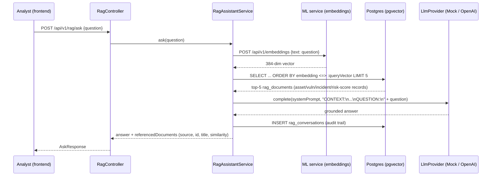

# RAG Security Assistant

Source: `backend/src/main/java/com/deloitte/erip/rag/`.

## Flow

## Indexing (building the knowledge base)

`RagIndexingService.reindexAll()` runs every 30 minutes (`erip.rag.reindex-interval-ms`)
and on-demand via `POST /api/v1/rag/reindex` (ADMIN). It turns live rows from four
domains into short natural-language documents and embeds/upserts each into
`rag_documents`:

- **Assets** - name, type, business unit, criticality, exposure, owner
- **Vulnerabilities** - CVE, CVSS, severity, status, exploit/patch availability
- **Incidents** - number, severity, status, related asset, root cause, resolution
- **Risk scores** - overall score, tier, and all five components for the latest score per asset

Because the knowledge base is built from live platform data rather than a static corpus,
the assistant's answers stay current as assets/vulnerabilities/incidents change, and every
answer can cite a real, clickable record (`sourceType` + `sourceId`) instead of a vague
"the documentation says."

## Why grounding matters here specifically

An LLM asked "which assets have the highest risk score" with no context will either
refuse or - worse - fabricate plausible-sounding asset names and scores. The system
prompt in `RagAssistantService` explicitly instructs the model to answer *only* from the
retrieved `CONTEXT` block and to say so plainly when the context doesn't contain the
answer, and every response records which documents were retrieved
(`AskResponse.referencedDocuments`) so a user can verify the grounding themselves rather
than trusting the model's word for it.

## Embedding strategy: HashingVectorizer instead of a hosted/transformer model

A real production deployment would call a hosted embedding model (OpenAI
`text-embedding-3-small`, Cohere, etc.) or run a local sentence-transformers model. Both
require either network egress + an API key, or a multi-hundred-MB model download at
build/first-run time - friction that's disproportionate for a portfolio project meant to
run identically on any machine with `docker compose up`. Instead,
`ml-service/app/services/embedding_service.py` uses scikit-learn's `HashingVectorizer`
(384 dimensions, L2-normalized, unigrams+bigrams): fully deterministic, zero downloads,
identical output on every machine. It captures lexical/bag-of-words similarity well
enough for this platform's short, templated records (two records about the same CVE or
the same asset name score highly similar), but **does not** capture deep semantic
similarity the way a transformer embedding would (e.g. it won't know "RCE" and "remote
code execution" are the same concept unless both n-grams co-occur in training text).
This trade-off is exactly why `LlmProvider` is a pluggable interface - swapping in
`OpenAiLlmProvider` for the completion step is a one-line config change
(`erip.llm.provider=openai`); swapping the embedding backend for a hosted one would
follow the same pattern if semantic recall became a priority.

## pgvector without JPA

Spring Data JPA / Hibernate (as bundled with Spring Boot 3.3) has no first-class mapping
for Postgres's `vector` type. Rather than fighting the ORM, `RagDocumentStore` uses
`JdbcTemplate` directly with explicit `::vector` casts for both writes and the
`<=>` cosine-distance similarity query - a deliberate, narrow exception to "everything
goes through Spring Data repositories" for the one table where that pattern doesn't fit.

## LLM provider abstraction

`LlmProvider` is a two-method interface (`complete`, `providerName`). Two implementations
ship:

- **`MockLlmProvider`** (default, `erip.llm.provider=mock`) - deterministic extractive
  summarization over the retrieved context. No API key, no network call, fully
  reproducible in CI and demos.
- **`OpenAiLlmProvider`** (`erip.llm.provider=openai`) - calls any OpenAI-compatible
  chat-completions endpoint (`erip.llm.base-url`, default `api.openai.com/v1`), so the
  same code path works against OpenAI itself or a compatible self-hosted gateway.

Selection is via Spring's `@ConditionalOnProperty`, so `RagAssistantService` depends only
on the `LlmProvider` interface and never branches on which backend is active.
